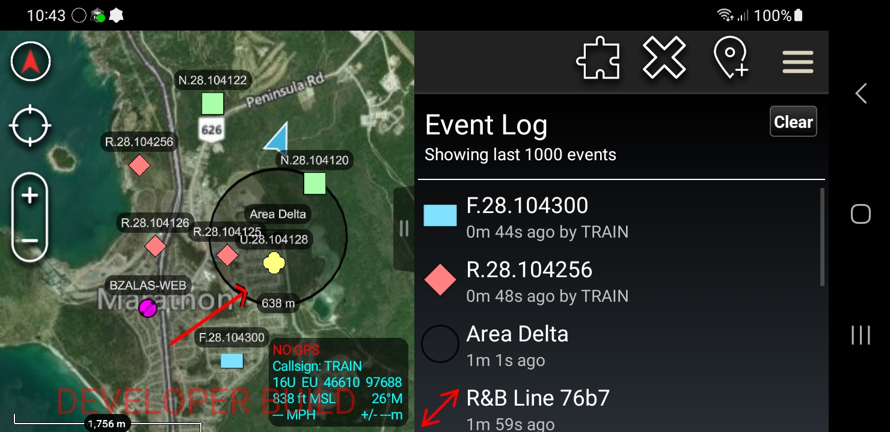

# TAKLog

## Description

TakLog is a ATAK plugin allowing user to track events occurring in the application.

## Features

- Displaying latest events in the log
- Restoring deleted items on the map
- Centering view on selected log item

